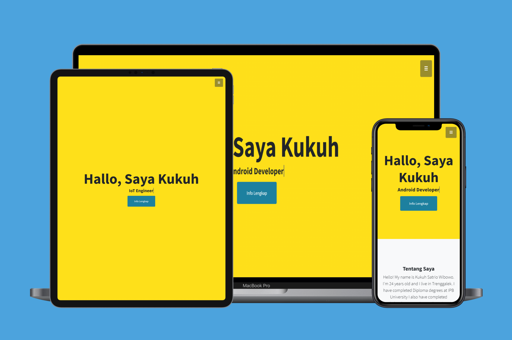

# Personal Portofolio With CMS

  

## Description

This is my personal portofolio website using MVC pattern and there is CMS dashboard for certificate

## Tech

- Node Js
- Express Js
- Postgresql
- Sequelize
- JWT
- Passport
- Bootstrap
- Ejs
- Model View Controller (MVC) Pattern

## How to use

- Install all dependency -> npm install
- Configure your database in config.json
- Create your database with -> sequelize db:create
- Migrate your table with -> sequelize db:create
- Run the code with -> npm run start

## Website Preview

[Here is the website](https://satrioportofilio.netlify.app/)

## Preview

1. Home
   
2. CMS Dashboard
   
3. Display data in dashboard
   
4. Display data in portofolio
   
