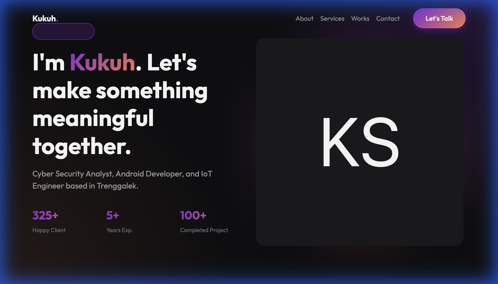
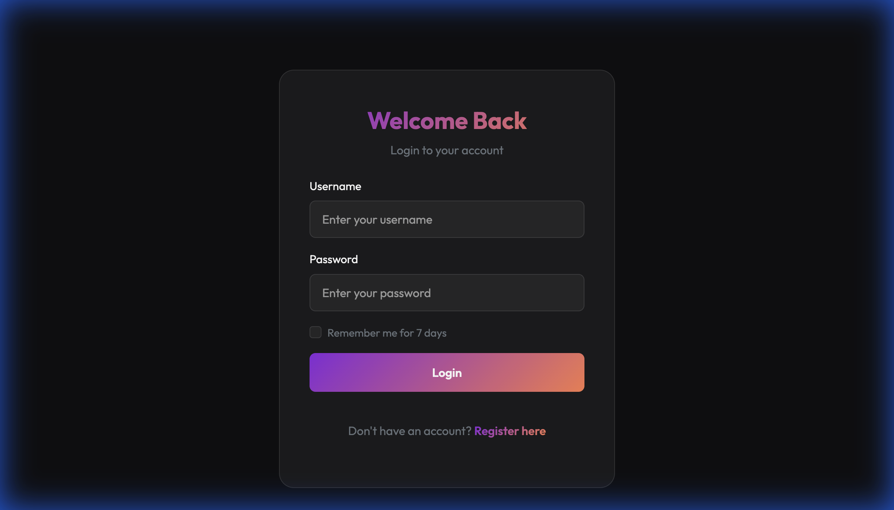
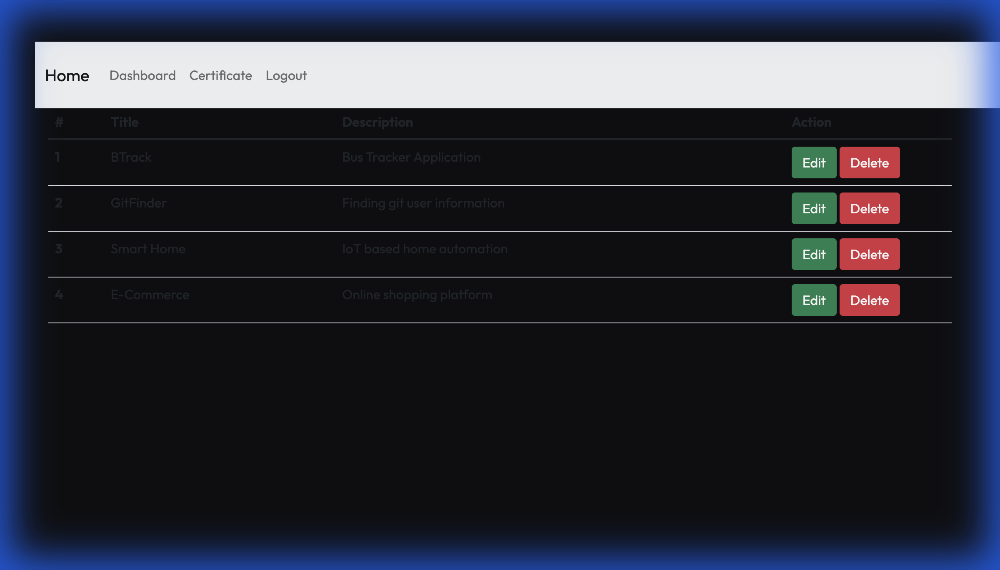
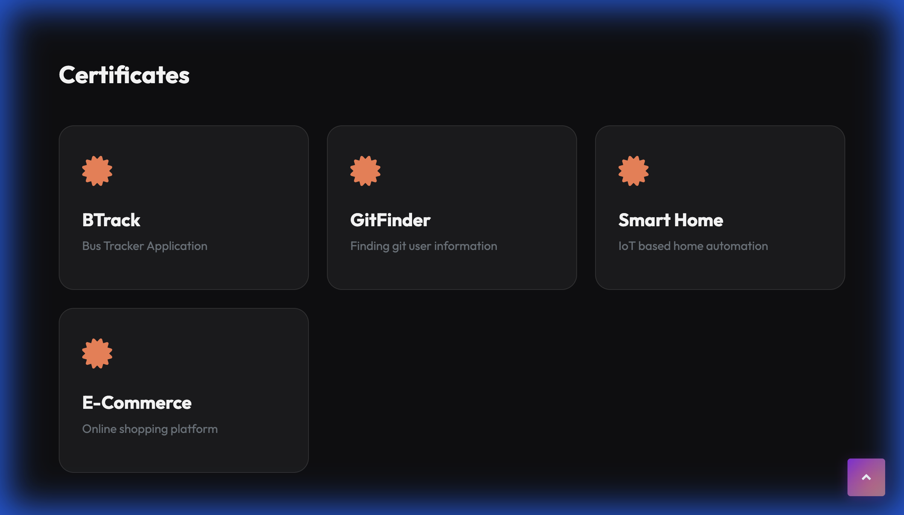

# Personal Portfolio With CMS

<p align="center">
  
</p>

## 📝 Description

This is a personal portfolio website built with the MVC pattern, featuring a secure CMS dashboard for managing projects and certificates. The application is fully Dockerized and includes a modern, dark-themed UI.

## 🚀 Key Features

- **Modern UI/UX**: Dark theme with glassmorphism design, responsive layout, and smooth animations.
- **Secure Authentication**: 
  - JWT-based auth with HTTP-only cookies
  - Rate limiting (Brute-force protection)
  - Secure password hashing (Bcrypt)
  - "Remember Me" functionality (7 days)
- **CMS Dashboard**: Manage projects and content easily.
- **Project API**: Full REST API with authentication and media upload support.
- **Media Management**: Upload images and videos for projects with automatic validation and cleanup.
- **Dockerized**: Easy deployment with Docker and Docker Compose.

## 🛠 Tech Stack

- **Backend**: Node.js, Express.js
- **Database**: PostgreSQL, Sequelize ORM
- **Auth**: Passport.js, JWT, Bcrypt
- **Frontend**: EJS, Bootstrap 5, Vanilla CSS
- **DevOps**: Docker, Docker Compose

## 📸 Preview

### 1. Homepage (Portfolio)
<p align="center">
  
</p>

### 2. Login Page (New Design)
<p align="center">
  
</p>

### 3. CMS Dashboard
<p align="center">
  
</p>

### 5. Certificates Section
<p align="center">
  
</p>


## 📦 How to Run

### Option 1: Using Docker (Recommended)

1. **Clone the repository**
   ```bash
   git clone <repository-url>
   cd ksw-portofolio
   ```

2. **Run with Docker Compose**
   ```bash
   docker-compose up --build
   ```

3. **Access the application**
   - Homepage: http://localhost:3000
   - Login: http://localhost:3000/user/login

### Option 2: Manual Installation

1. **Install dependencies**
   ```bash
   npm install
   ```

2. **Configure Database**
   - Create a `.env` file based on `.env.example`
   - Update database credentials in `config/config.js`

3. **Setup Database**
   ```bash
   npx sequelize-cli db:create
   npx sequelize-cli db:migrate
   npx sequelize-cli db:seed:all
   ```

4. **Run the application**
   ```bash
   npm start
   ```

## 🔑 Default Credentials

- **Username**: `admin`
- **Password**: `admin123`

> **Note**: Registration is disabled by default for security. You can enable it in `router/adminRouter.js` if needed.

## 📡 API Documentation

The application provides a REST API for managing projects.

**Base URL**: `/project`

| Method | Endpoint | Auth | Description |
|--------|----------|------|-------------|
| GET | `/` | No | List all projects |
| GET | `/:id` | No | Get single project |
| POST | `/` | Yes | Create project (supports image/video upload) |
| PUT | `/:id` | Yes | Update project |
| DELETE | `/:id` | Yes | Delete project |

**Media Upload**:
- Images: Max 5MB (.jpg, .png, .webp)
- Videos: Max 50MB (.mp4, .webm)

## 📄 License

MIT License
