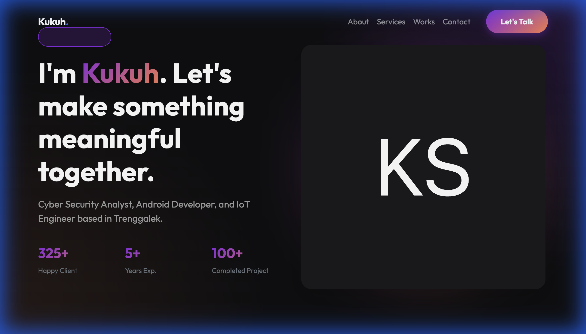
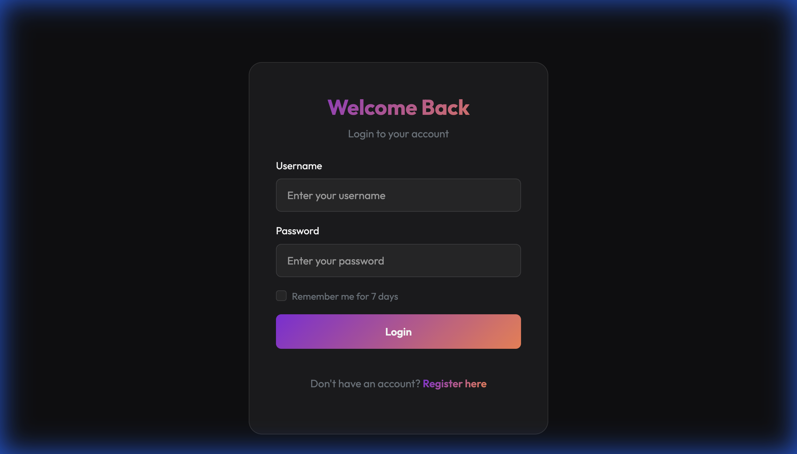
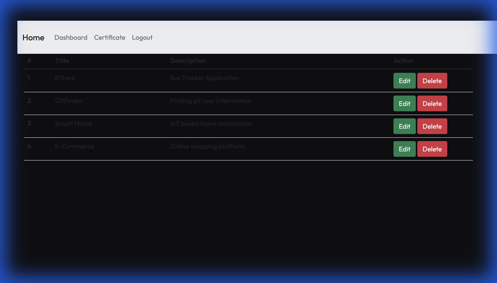

# Personal Portfolio With CMS

<p align="center">
  
</p>

## 📝 Description

This is a personal portfolio website built with the MVC (Model-View-Controller) pattern, featuring a secure and user-friendly **CMS dashboard** for managing both 'Projects' and 'Certificates' independently. The application is fully Dockerized for effortless deployment and boasts a seamless, modern, dynamic dark-themed UI.

## 🚀 Key Features

- **Modern UI/UX**: Distinctive dark theme with glassmorphism design, responsive layouts, intuitive hover effects, and proportional thumbnail image scaling using `object-fit: cover`.
- **Full CMS Capabilities**:
  - Independent CRUD operations for **Projects** (Works) and **Certificates**.
  - Interactive UI for uploading image covers directly from the CMS Panel.
  - Changes instantly reflect dynamically on the homepage portfolio.
- **Secure Authentication**: 
  - JWT-based auth utilizing HTTP-only cookies.
  - Rate limiting against brute-force attacks.
  - Secure password hashing (Bcrypt).
  - "Remember Me" functionality (7 days duration).
- **Project API**: Full REST API endpoints with authentication and multipart media upload support built-in alongside the web forms.
- **Auto-Deployment**: Docker Compose configuration that inherently applies Sequelize migrations and database checking/seeding directly upon container boot.

## 🛠 Tech Stack

- **Backend**: Node.js, Express.js
- **Database**: PostgreSQL, Sequelize ORM
- **Auth**: Passport.js, JWT, Bcrypt
- **Frontend**: EJS View Engine, Bootstrap 5, Vanilla CSS
- **DevOps**: Docker, Docker Compose

## 📸 Preview

### 1. Homepage (Dynamic Portfolio)
The homepage auto-fetches real data via standard database calls, meaning no more hard-coded project texts.
<p align="center">
  
</p>

### 2. Login Page (Dark Glassmorphism)
<p align="center">
  
</p>

### 3. CMS Dashboard (Projects & Certificates)
Manage all your data through elegant data tables integrated with direct edit and add capabilities.
<p align="center">
  
</p>

## 📦 How to Run

### Option 1: Using Docker (Recommended)

Start the environment out-of-the-box. The container will automatically run Database Migrations and Seeders simultaneously.

1. **Clone the repository**
   ```bash
   git clone <repository-url>
   cd ksw-portofolio
   ```

2. **Build and Run with Docker Compose**
   ```bash
   docker compose up -d --build
   ```
   *Note: Using `--build` ensures any code refinements you pulled are ingested properly.*

3. **Access the application**
   - Homepage: `http://localhost:3000`
   - CMS Login: `http://localhost:3000/user/login`

### Option 2: Manual Installation without Docker

1. **Install dependencies**
   ```bash
   npm install
   ```

2. **Configure Database**
   - Create a `.env` file based on `.env.example`
   - Ensure an active local PostgreSQL server runs and update existing credentials in `config/config.js` properly.

3. **Database Setup**
   ```bash
   npx sequelize-cli db:create
   npx sequelize-cli db:migrate
   npx sequelize-cli db:seed:all
   ```

4. **Run the application**
   ```bash
   npm start
   ```

## 🔑 Default Credentials

- **Username**: `admin`
- **Password**: `password` (Depends on your local `.env` seeding)

> **Note**: Registration is disabled by default for portfolio security purposes. You can re-enable it strictly in `router/adminRouter.js`.

## 📡 API Documentation

The application concurrently provides a REST API tailored for external consumption.

**Base URL**: `/project`

| Method | Endpoint | Auth | Description |
|--------|----------|------|-------------|
| GET | `/` | No | List all projects |
| GET | `/:id` | No | Get single project |
| POST | `/` | Yes | Create project (supports image upload) |
| PUT | `/:id` | Yes | Update project |
| DELETE | `/:id` | Yes | Delete project |

## 📄 License

MIT License
